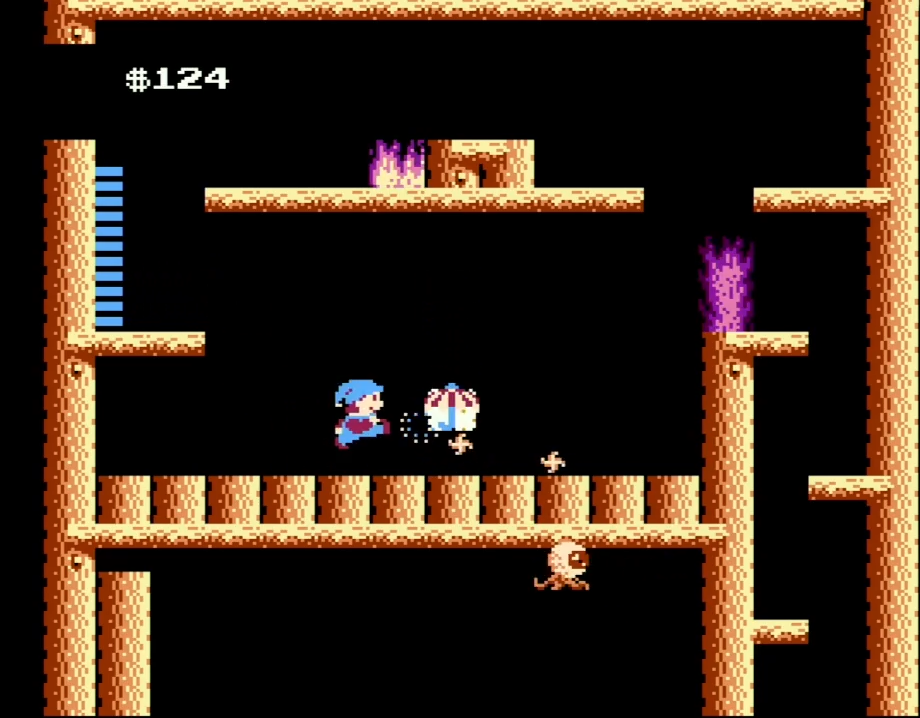
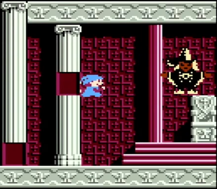
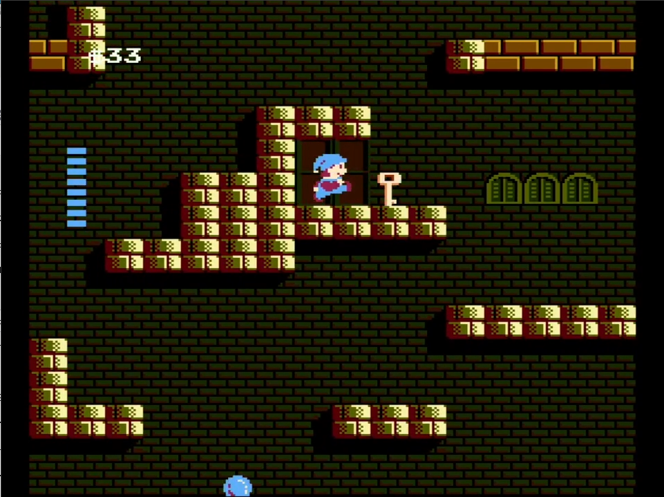
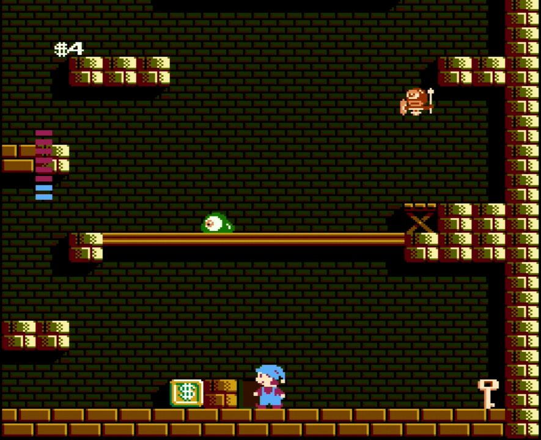

迷宮組曲100%TA(安定チャート)
---

迷宮組曲ってクリア時に所持アイテムが表示されたりするわけではないので、Any%以外のカテゴリはTrueEND(8周)になるのかなと思ってたら100%なるものが存在するらしいので走ってみたら19分半を切れたりした。[動画はこちら](https://www.youtube.com/watch?v=WKcfcYxb2_E)。簡単にチャートを書いておく。

各種表記は『ファミコン攻略ブック　迷宮組曲ひみつ攻略法』に準拠する。物心ついた頃から読み漁った思い出の本の一つ。

# レギュレーション

ゲームスタート後、ミロンが動き始めた瞬間から計測開始。マハリト撃破した瞬間でタイマーストップ。

100%の定義として、通常のクリアに加えて下記条件を満たす必要がある。

- ショップで購入するアイテム12個取得
- ハニカム9個取得
- クリスタル7個取得
- ツエとカンムリを取得
- 楽器の箱7個取得

(コインやハチスケは取らなくていい)

# 基本知識

## パラソルの周期

パラソルを取得するごとにミロンの放つバブルが2連射、3連射と増えて攻撃力が単純に2倍、3倍になる。この連射は城の外からおもての部屋に入った時に初期値にリセットされる(初期値はクリスタルの取得状況による)。

パラソルは雑魚キャラを倒した際に一定周期で発生する。電源投入からの雑魚キャラを倒した数が、1連射の場合10匹以上、2連射の場合14匹以上、3連射の場合18匹以上撃破で必ず発生する。ただしパラソルが出るたびにこのカウントはリセットされる。

「以上」と書いたのは、例えば2連射状態で12匹倒して、ステージ移動により1連射にリセットされた場合、次の雑魚キャラ=13匹目撃破で出現する。特に井戸の奥、火の部屋では雑魚キャラが2匹しか出ないこともあり、どちらかを撃破した際に必ずパラソルがドロップするように調整が必須。

それ以外のステージでもパラソル周期は意識するとタイム短縮しやすい。

## マハリト乱数固定

いわゆる電源パターンという奴。ラスボスのマハリトは橙、青、赤、緑の4部屋のどこかにランダム出現し、残り3部屋はクロウが化けたニセモノである。スタートボタンを押しながら電源投入することで、マハリトが赤の部屋に固定される。

## カギの出現条件

各通常ステージを脱出するためにはカギの取得が必要。下記の数がステージごとに定められたある閾値を超えた時にカギが出現する。

- 敵の撃破または敵の弾に被弾
- コインの取得
- ブロックの破壊

カギの出現箇所は基本2パターンあり、それぞれに閾値が異なる。具体例として、はなれコインの部屋の場合は下図参照。タイムアタックの場合は前者を採用する。

- 4コイン取得+5匹撃破

    

- 4コイン取得+15ブロック破壊

    

なおダンロの部屋に限り脱出せずに隠し部屋に進むためカギの取得は不要。

## ボーナスステージ

楽器の箱を取ると出現。音符を取るとスコア1、シャープを取るとスコア2、フラットを取るとスコアマイナス1(ただし0を下回らない)。取得スコアが50未満なら取得スコア/4(切り捨て)が、取得スコアが50以上なら取得スコア/2がコインとして加算される。100%TA(最速チャート)ではスコアを平均56程度取る必要があるが、100%TA(安定チャート)では後述のコイン増殖により、3ステージ程度で50以上を取れば良い。

## コイン増殖技

ホーマを撃破しコンテニューを可能にしてから、ゲームオーバーしてタイトル画面の連射測定機能で連射数を増やしてからコンテニューすると、次に入ったボーナスステージの初期値が0でなくタイトル画面の連射数になる。理論値は225らしい？が現実的には160前後が限界ではなかろうか。100%TA(安定チャート)においてはコイン入手源として多くを占めるため、自分がどの程度連射できるのか、他のボーナスステージでどの程度稼げるのかと相談して、各ステージでの生コイン取得数を調整する。

## 敵の再出現

敵を撃破した時にランダムでハートをドロップする。ハートをドロップした場合、その敵は再生成されない。敵の撃破数を稼ぎたいときにはタイムロス要素となるため、ハートを取得できないところで敵を倒さないように注意が必要。

## ボーナスステージ終了後のミロン出現位置

ボーナスステージ終了後のミロン出現位置は原則ステージ開始位置だが、ステージ内にショップがあった場合はショップ前に変更される。これはコンテニューした場合も同じ。

## ミロンのジャンプ高度の乱数

タイムをブレさせる影ながら最大の乱数要素。ミロンくんは4ブロック分の高さをジャンプして登れるのだが、たまに届かないことがある。原因は不明。祈るしかない。

# ルート

1. 1F
	1. はなれコインの部屋
    1. アイテムショップ：クスリ
    1. 石だんの部屋
    1. 7大巨獣の部屋：ホーマ
1. 2F
    1. ハドソンの部屋
    1. 井戸～火の部屋～ドーマ
    1. ドミノの部屋
    1. (1F)ショップ：ノコギリ
    1. バルカーマ
1. 3F
    1. トラップの部屋
    1. ショップ：エノグ
    1. ねじりん棒の部屋
    1. 氷の部屋～レッドバルカーマ
    1. ダンロの部屋～魔神殿II
    1. 迷いの部屋～魔神殿I
1. 4F
    1. マハリトの部屋

# ルート詳細

## はなれコインの部屋

計6～10コイン取得。

4コイン+5匹撃破でカギを取得する。

スライムアイ1匹を倒し楽器の箱を取得。ボーナスステージが終わったらスライムアイ、タンボ1匹を倒してハニカム取得。右に戻り、タンボを1～2匹、スライムアイ、カムリを倒して敵撃破数を5に。コイン4を取得してカギ取得。マウリを倒せれば倒し、ドア前のコインは無理なく取れる分だけ取って脱出。

タンボを1～2匹としているのは、最初に倒したタンボがハートドロップした時に卵が発生しないため。ここまでで敵の撃破数は7～8になっているはず。

## 石段の部屋

計5コイン取得。

1コイン+ブロック破壊(多分15？)でカギを取得する。

ハードタルを倒して、減速しないようにコインを取得しながら登り、撃破数が8だったなら可能なら9に調整。シューズショップへ。ショップから出たタイミングで左下にバブル発射しハードタルを撃破。撃破数が10ならパラソルが出るので取得。右側へ進みハニカムを取得、楽器の箱を取得。ショップ前から再開するため再度左下にバブルを発射しハードタルを倒す。右側へ降りて最下部のブロックを破壊する。はなれコインの部屋で最下段のコインを取得していない場合、何故かこの中にコインが1つ生成されるため取得しながら右端まで駆け抜ければカギを取得できるので脱出。ここまでで敵撃破数を3～4程度稼いでおきたい。

## 7大巨獣の部屋：ホーマ

2連射なので瞬殺できるが、可能な限り連続被弾しライフを削っておく。

## ハドソンの部屋

計4～5コイン取得。

4コイン+5匹撃破でカギ取得。

開始直後に見えるカッチンシャーで自決。タイトルの連射数を稼いでコンテニュー。カッチンシャーとパウメルかゲルボを倒しながら楽器の箱を取得。井戸でのパラソル取得に備えて敵撃破数を出来れば9、ダメでも8で脱出したいので、ここまでの累計敵撃破数を要確認。5匹以上倒している場合はカギ出現条件を満たすためパウメル・サフマの弾に積極被弾する。カギが出現したら右下のショップへ向かいチョッキを購入。ボグにあたって小さくなって脱出。

## 井戸

ブードゥーでパラソル取得出来ればOK。チョッキがあるので大した被弾も警戒不要。ハニカムを忘れずに取得してドーマ撃破。撃破後はメダマルゲを左下で倒して脱出。Any%同様、撃破して上に登ってフーセン取得が安定だと思う。TASルートは正直むずい。

## ドミノの部屋

計7コイン程度取得。ロス小さく取れるのは最大9コインかな？

4コイン+ブロック撃破幾つかでカギ取得。

井戸脱出時点で累計撃破数が0か1のハズ。ぐるっと回って楽器の箱取得までで2～3匹撃破。再度ぐるっと回ってショップでランプを購入した時点で5～6匹撃破のはず。ハニカム取得し、カギ出現のためにコイン取得する際にビートやカムリ、あるいは脱出時のスライムアイ撃破でパラソル取得し2連射にして脱出。

## 7大巨獣の部屋：バルカーマ

特筆なし。倒すだけ。

## トラップの部屋

計4～7コイン取得。

4コイン+5匹撃破でカギ取得。

ドミノの部屋で累計撃破数が1か2くらいになっていることが多い。まずは楽器の箱取得。カッチンシャーとブレイントトを倒しながら登り、最上部のドミノ地帯をギョロを倒しながら右へ。中央の4コインを取ったら降りてアグアグを撃破。ここまでの撃破数と相談しながら敵を倒すかブレイントトの弾で被弾するかして右端中段に出たカギを取得、右上に上って(だいたいの場合アグアグを殺させられて)ハネを購入。ショップから出たら敵の撃破数と相談しながら倒すか被弾して無理やり抜けるかして下へ。ハチスケを取ったらドミノ地帯を駆け抜けて脱出。

## ねじりん棒の部屋

計7～16コイン程度取得。

4コイン+ブロック破壊でカギ取得。

最初のタンボか、エレベーター周りのアグアグやタンボ、ハードタルくらいでパラソルを取得したい。エレベーターで登りエクスカリバーを購入。ショップにはかなり入りづらいので気を付ける。ショップから出たら右側のブロックを壊しまくってハニカム取得。この時、壊せる地帯の左側右端を盾に落ちれるようにブロック破壊しておくことでカギの取得がスムーズになる。左へ回り楽器の箱を取得。ボーナスステージを出たら左にバブルを発射。2列目のねじりん棒の上から5つ目のブロックを確実に破壊することで最速で脱出できる。この後に備えてなるべく敵を撃破しておくこと。

## 氷の部屋

コイン取得は0。

カギ取得不要。

ねじりん棒の部屋での敵撃破数次第ではあるがパラソルを取得し2連射にしたらすぐレッドバルカーマへ向かう。ただし道中で敵撃破数を稼ぐほどあとで迷いの部屋が楽になる。

## ダンロの部屋

コイン取得は3～19。最後のコイン数調整をする。楽器の箱以外でこの後スムーズに取得できるコインは17。ホバリングを買った後43以上残っていれば勝ち。35以上ならロスは少ない。34以下だった場合はダンロの部屋の無限復活コインで稼ぐことになる。つらい。

カギ取得不要。

楽器の箱取得までに雑魚3匹、ショップに入るまでに雑魚3匹、ダンロに入るまでに雑魚4匹を倒すので確実に2連射にはなれる。

## 魔神殿II

ホバリングを活用して落下しないように左上へ。偽エルシラを撃破したら下へ降りて右側から外へ。

## 迷いの部屋

できれば14匹倒して3連射にしたいので氷の部屋での撃破数がものをいう。3連射にしてからブルードーマを目指した方がいいと思う。

## 魔神殿I

ホバリングを活用して中央の足場へ。ハチスケだけ取ったら偽エルシラを撃破して右から脱出。

## はなれコインの部屋(左上)

カーマ撃破してからホバリングを活用して確実にはなれコインの部屋左上に入る。コインに余裕があってライフが心もとないならハイパワーを買う。ハイパーシューズを買ったらマハリトを目指す。

## マハリトの部屋

最速で本体へ。ボグを触るときは下からの大ジャンプで触る方が早いと思う。本物マハリトは柱に挟まったまま連射で倒すのが早いし安定する。
